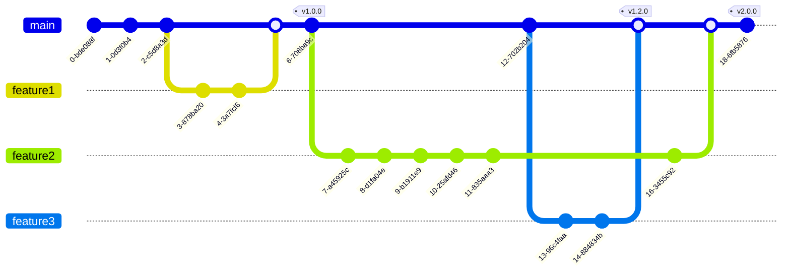

---
# try also 'default' to start simple
theme: eloc
# https://sli.dev/custom/highlighters.html
highlighter: prism
# show line numbers in code blocks
lineNumbers: false

title: 'Intro to Git'

# some information about the slides, markdown enabled
info: |
  ## Git intro
# persist drawings in exports and build
drawings:
  persist: false

# enable pdf download in SPA build
download: true
exportFilename: 'intro-to-git'

selectable: true

aspectRatio: '16/9'

# disable presenter mode in build, but allow in dev
presenter: dev

transition: fade

# force light mode
colorSchema: 'light'

class: 'text-center'
---

 
<!-- insert presentation information here -->

<qrcode-vue :size=300 /> 
 
follow along!

<presentation-url class="text-center absolute bottom-20" />

---

---
layout: statement
class: 'text-center'
---

# Why use version control?

  

    <flat-color-icons-collaboration class="text-70"/>
    <i>collaboration</i>
  

  

    <mdi-test-tube class="text-70 text-blue-500"/>
    <i>reproducibility</i>
  

  

    <mdi-cloud-upload class="text-70 text-green-500"/>
    <i>backups</i>
  

---
layout: statement
class: 'text-center'
---

# Version control in academia

  

   <mdi-file-code-outline class="text-70 text-purple-500"/>
   <i>software</i>
  

  

   <mdi-robot-industrial class="text-70 text-amber-500"/>
   <i>designs</i>
  

  

   <mdi-fountain-pen class="text-70 text-blue-500"/>
   <i>writing</i>
  

  

   <mdi-code-brackets class="text-70 text-green-500"/>
   <Link to="zenodo"><i>citations</i></Link>
  

---
layout: section
---

# Types of version control

---

## Centralized

## Decentralized

---

---
clicks: 3
---

# git building blocks
<ul>
  <li v-click="1"> <b>commits</b>: a snapshot of your files* </li>
  <li v-click="2"> <b>commit graph</b>: commits are organized into a <i>directed acyclic graph</i> </li>
</ul>

 

### history

<arrow v-click="3" x1="350" y1="640" x2="350" y2="520" color="#f59e0b" width="6"/>

*if git is *tracking* the files

---

---
layout: statement
class: 'text-center'
---

# Create a repository

<a href="https://github.com/new">https://github.com/new</a>

---
layout: statement
class: 'text-center'
---

# Clone the repository <mdi-download-box class="color-blue-500" />

`git clone`

---
clicks: 9
---

# The basics

<v-clicks>

- `git add`
- `git commit`
- `git push`
- `git pull`
- `git status`
- `git log`

</v-clicks>

#### committing changes

#### interact with GitHub

#### view what you've done

<svg width="100" height="500" class="stroke-amber-500">
<polyline points="0,40 80,40 80,190 0,190" fill="none" stroke-linecap="round" stroke-linejoin="round" stroke-width="8"/>
</svg>

<svg width="100" height="500" class="stroke-blue-500">
<polyline points="0,40 80,40 80,190 0,190" fill="none" stroke-linecap="round" stroke-linejoin="round" stroke-width="8"/>
</svg>

<svg width="100" height="500" class="stroke-red-500">
<polyline points="0,40 80,40 80,190 0,190" fill="none" stroke-linecap="round" stroke-linejoin="round" stroke-width="8"/>
</svg>

---
layout: section
---

# The three trees

---

# File states

modified

<mdi-arrow-left-right class="text-9xl color-gray-500"/>

staged

<mdi-arrow-right class="text-9xl color-gray-500"/>

committed

---

---

# The index / staging area

- staging changes: `git add <files>`
- viewing the index: `git status`

---

# Committing changes

`git commit`

- only changes in the staging area are added to the commit
- commits need a *commit message*

---

# Viewing changes

- working tree <mdi-arrow-left-right /> staging area: `git diff`
- staging area <mdi-arrow-left-right />  HEAD (the parent commit): `git diff --staged`

---

# Exercise

1. modify the contents of your `README.md` file
2. stage those changes (`git add`)
3. commit the changes (`git commit`)

---

# Viewing history

`git log`

---

# Exercise

1. create a new file: `test.md`
2. write stuff in `test.md`
3. add `test.md` to the staging area
4. commit your changes

---
layout: section
---

# Commit philosophy

<emojione-thinking-face class="text-50"/>

---

# When to commit?

<v-clicks>

- you complete a *logical, atomic unit* of work
- you might want to undo those changes

</v-clicks>

---

# What to commit?

### do commit

- source code
- design files
- documentation

### don't commit

- build artifacts
- large data files

---

# Commit messages

### philosophy

- tell a *story* of your project's history
- capture *why*

### content

- short summary
- extended description

---
layout: statement
class: 'text-center'
---

oops! <emojione-bug /> <emojione-grinning-face-with-sweat />

 

# Reverting changes

`git revert`

---

# Exercise

1. revert your first commit

---
layout: section
---

# Interacting with GitHub

local vs. remote repositories

---
layout: full
---

---
layout: full
---

---

# Exercise
#### *pushing* to GitHub (the "remote" repository)

1. verify that your local branch is ahead of the remote
   &nbsp;&nbsp;&nbsp;&nbsp;&nbsp;&nbsp;&nbsp;&nbsp; `git status`
2. push your local changes to the GitHub repository (remote)

---
layout: full
---

---
layout: full
---

---

# Exercise
#### *pulling* from GitHub

1. edit a file and make a commit using your repo's GitHub webpage
2. pull those changes into your local repo

---
layout: section
---

# Tags and branches

a commit by any other name...

---

# Tags

<v-click>

`git tag -a v0.1`

</v-click>

---

# Exercise

1. tag your most recent commit as `v1.0`

---
clicks: 1
---

# Branches

---

# Branching commands

- create branch: `git branch <branch-name>`
- change current branch: `git switch <branch-name>`
<!-- - changing branches: `git checkout <branch-name>` -->
<!-- - both at the same time: `git switch -c <branch-name>` -->

---

# Exercise

1. create a branch called `cool-feature` and switch to it
2. add `hello from cool-feature branch` to your `README.md`

---

## Merging branches

---

# Merging branches

`git merge <branch-to-merge>`

- need to be in the branch you want to *merge into*

---

# Exercise

1. switch to your `main` branch
2. merge `cool-feature` into `main`

---

## Typical feature branch workflow

---

<mdi-presentation class="text-200 text-blue-500"/>

<mdi-arrow-right class="text-150 text-amber-500" />

<qrcode-vue :size=500 />

<presentation-url class="absolute bottom-20" /> 

---
layout: section
---

# Bonus slides

<emojione-party-popper class="text-50" />

---
routeAlias: zenodo
---

## Archiving code with <a href="https://zenodo.org/">Zenodo</a>

assign DOIs <mdi-code-brackets class="text-green-500"/> to your code <mdi-file-code-outline class="text-amber-500"/>

- [random example](https://zenodo.org/record/8370339)
- [how to](https://docs.github.com/en/repositories/archiving-a-github-repository/referencing-and-citing-content)

---

# Resources <emojione-books />

- [git - the simple guide](https://rogerdudler.github.io/git-guide/)
- [GitHub Git Guides](https://github.com/git-guides/)
- [Atlassian git tutorials](https://www.atlassian.com/git/tutorials)
- [Think like (a) Git](https://think-like-a-git.net/)
- [Git best practices](https://sethrobertson.github.io/GitBestPractices/)

- [Command line Git](https://docs.gitlab.com/ee/gitlab-basics/start-using-git.html)
- [Pro Git book](https://www.git-scm.com/book/en/v2)
- [GitLab git cheat sheet](https://about.gitlab.com/images/press/git-cheat-sheet.pdf)
- [GitHub git cheat sheet](https://training.github.com/downloads/github-git-cheat-sheet/)
- [The art of the commit](https://alistapart.com/article/the-art-of-the-commit/)

---

Playground: <a href="https://git-school.github.io/visualizing-git">https://git-school.github.io/visualizing-git</a>

<iframe src="https://git-school.github.io/visualizing-git" title="https://git-school.github.io/visualizing-git"></iframe>

